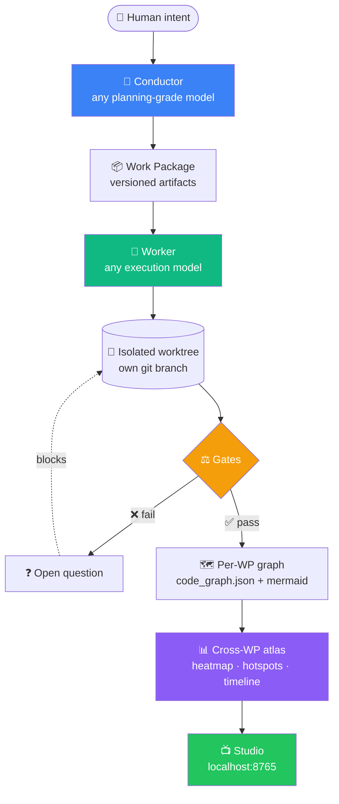
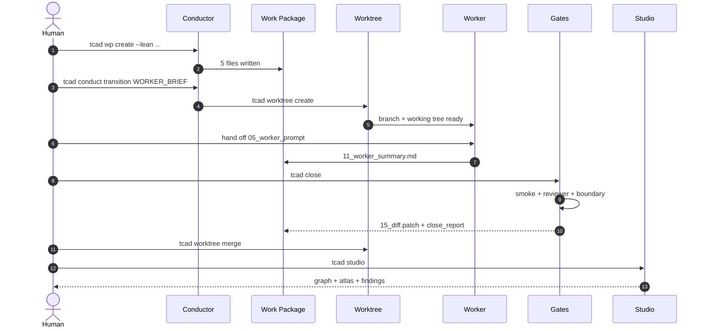

# 🏗️ TCAD-H

> **Deterministic harness for multi-agent coding.**
> Coordinate Claude Code, OpenCode, Kimi, Qwen, DeepSeek, GPT, Minimax — without losing context, scope, or your mind.

   

> ⚠️ **Alpha software.** Pre-1.0. Expect breaking changes between commits.

```bash
git clone https://github.com/MiguelAAR10/tcad-h.git ~/.tcad-h
cd ~/.tcad-h && ./install.sh
tcad quickstart
```

---

## 🧭 Quick nav

[Why](#-why-this-exists) · [How it works](#-how-it-works) · [Models](#-pick-any-model-per-role) · [Install](#-install) · [First WP](#-five-minute-first-wp) · [Iron rules](#-iron-rules) · [Phases](#-where-we-are) · [Trial](#-the-field-trial) · [CLI](./docs/CLI.md) · [Concepts](./docs/CONCEPTS.md) · [Quickstart](./docs/QUICKSTART.md)

---

## 💡 Why this exists

Working with one coding agent is hard. Working with five in parallel breaks down on its own:

| Pain | Concrete failure |
|---|---|
| 🧠 **Context rot** | Agents hand each other 60K-token chat histories. Signal collapses. |
| 🎯 **Scope creep** | Agents proactively "fix" things outside the task. |
| 🪞 **Silent duplication** | Agent adds `def health()` even when one already exists six lines above. *(Real case caught in our Phase 2.3 trial.)* |
| 💥 **Race conditions** | Two terminals editing the same tree → ghost diffs, broken merges. |
| 🌊 **Diff overwhelm** | 500-line patch tells you nothing about which capability of the product just changed. |

TCAD-H fixes each one with a **deterministic mechanism**, not a prompt.

> 🚫 **No model receives conversation history.**
> ✅ **Every model receives versioned files on disk.**

---

## 🔭 How it works



**Every box is Python + git + JSON.** Zero LLM in the core pipeline. The LLM lives in the workers — never in the gates.

### What each gate catches

```mermaid
flowchart LR
    P[patch] --> B[🚧 Boundary firewall<br/>path-level]
    B --> SM[🧪 Smoke gate<br/>shell commands]
    SM --> R[🛡️ Reviewer gate<br/>duplicate routes / symbols]
    R --> M[🔀 Merge preconditions<br/>summary + blockers + ff-only]
    M --> ✓

    style B fill:#ef4444,color:#fff
    style SM fill:#f59e0b,color:#fff
    style R fill:#3b82f6,color:#fff
    style M fill:#10b981,color:#fff
```

---

## 🎚️ Pick any model per role

**Conductor is whatever model you have credits for.** TCAD-H does NOT lock you into Claude. Swap based on availability, token budget, and task complexity.

| Role | Default suggestion | Cheap fallback | Why this role exists |
|---|---|---|---|
| 🎼 **Conductor** | Claude Sonnet/Opus | GPT-5 · Kimi K2 | Drives FSM. Plans. Generates Work Packages. Never writes code. |
| 👷 **Backend worker** | Kimi · GPT | Qwen-Coder · DeepSeek | Reads WP, edits backend, writes summary. |
| 🎨 **Frontend worker** | Qwen-Coder · GPT | DeepSeek · Minimax | UI components, layouts. |
| 🧪 **Tests / Docs worker** | Minimax · DeepSeek | local Llama | Cheap repetitive work. |
| 🛡️ **Reviewer** | *different model than worker* | any other | Reads diff + report. Verdict PASS/FAIL. |
| 👀 **Watcher** | none (`tcad scan`) | — | Pure Python. Zero LLM. |

> ⚖️ **Token budget rule.** If a role is bottlenecked on cost, drop to a cheaper model. The protocol stays the same — only the model name changes.

Swap mid-project with `.protocol/terminals.yaml`. Example:

```yaml
terminals:
  - id: T1
    role: conductor
    tool: claude-code        # or codex-cli, opencode, kimi-cli...
    model_family: claude     # swap to gpt / kimi / qwen when needed
  - id: T2
    role: backend-worker
    tool: opencode
    model_family: kimi
    fallback_models: [gpt, claude-haiku, qwen-coder]
```

The FSM, gates, graph, atlas — **all model-agnostic by design.**

---

## ⚙️ Install

```bash
git clone https://github.com/MiguelAAR10/tcad-h.git ~/.tcad-h
cd ~/.tcad-h
./install.sh

# Ensure PATH (one-time, add to shell rc)
export PATH="$HOME/.local/bin:$PATH"

# Verify
tcad --version       # 0.1.0-alpha
tcad doctor          # health check
```

No sudo. No `pip install`. No PyPI dependency. The installer symlinks `tcad` into `~/.local/bin` (override with `TCAD_INSTALL_DIR`).

---

## 🚀 Five-minute first WP



Commands in order:

```bash
cd /path/to/your/project
tcad init                                                   # 1
tcad profile detect                                         # 2
tcad doctor                                                 # 3

tcad wp create --lean --name "add-health" \
  --goal "Add /health endpoint" --role backend              # 4

# Fill 02_allowed_files.md and 03_forbidden_files.md

tcad conduct init                                           # 5
tcad wp set WP-001-add-health
tcad conduct transition INTAKE
tcad conduct transition SPEC_DRAFT
tcad conduct transition HANDOFF_GEN
tcad conduct transition WORKER_BRIEF

tcad worktree create WP-001-add-health --role backend       # 6

# Hand the worker prompt to your CLI of choice:
#   opencode --read .protocol/handoffs/WP-001-add-health/05_worker_prompt_backend.md
#   kimi run ...
#   codex run ...

tcad close WP-001-add-health-backend \
  --smoke-test "pytest -q"                                  # 7

tcad graph build WP-001-add-health                          # 8
tcad worktree merge WP-001-add-health-backend
tcad worktree destroy WP-001-add-health-backend
tcad atlas build                                            # 9
tcad studio       # → http://127.0.0.1:8765                 # 10
```

Run `tcad quickstart` to see this same list at any time.
Full walkthrough: [`docs/QUICKSTART.md`](./docs/QUICKSTART.md).

---

## ⚔️ Iron rules

Five rules. Non-negotiable. Enforced by code, not by good behavior.

| # | Rule | Enforced by |
|---:|---|---|
| 1 | 🚫 No model receives conversation history. | Worker prompt restricts inputs to WP files. |
| 2 | 🛑 The Conductor never writes production code. | Conductor scope = `.protocol/` + `specs/`. |
| 3 | 🔁 The Reviewer is never the Implementer. | Reviewer role check in close pipeline. |
| 4 | 🚧 Open blocking questions halt progress. | FSM guards reject transitions while questions are pending. |
| 5 | 📏 No edit outside the WP's `02_allowed_files.md`. | `tcad boundaries check` exits non-zero. |

Full spec: [`PROTOCOL.md`](./PROTOCOL.md).

---

## ✅ What works today

<details>
<summary><strong>Capability matrix (alpha-ready)</strong></summary>

| Capability | Notes |
|---|---|
| Lean / verbose Work Packages | 5 vs 12 files |
| Git worktree isolation per WP+role | full lifecycle |
| Conductor FSM (17 states, deterministic) | Python only |
| Path boundary firewall (OS-level) | `tcad boundaries check --rollback` |
| Smoke-test gate (YAML config) | per-group |
| Deterministic reviewer gate | FastAPI/Express dupe routes + Python symbols |
| Evidence capture | patch + journal + close report |
| Per-WP static graph | code_graph.json + mermaid |
| Cross-WP atlas | heatmap, hotspots, timeline |
| Project profile detection | FastAPI / Next / React / Django / monorepo |
| Studio localhost UI | stdlib HTTP, no build step |
| `tcad doctor` | 20+ checks + suggestions |
| `tcad report alpha` | digest + next-action |

</details>

<details>
<summary><strong>Deferred (not in 0.1.0)</strong></summary>

| Capability | Why deferred |
|---|---|
| Cross-file duplicate detection | Out of scope for v0.1 reviewer |
| Flask / Django / NestJS route detectors | Add when a real WP demands one |
| Mermaid.js visual render in Studio | Raw markdown for now |
| LLM-based semantic enrichment | Only after the field trial closes |
| MCP server | After 0.4 |
| PyPI package | After field trial signal |
| Multi-user / team mode | Not in scope |
| Windows native install | POSIX paths in some scripts |

</details>

---

## 🛤️ Where we are

```mermaid
flowchart LR
    P1[1<br/>Handoff MVP] --> P15[1.5<br/>FSM]
    P15 --> P17[1.7<br/>Studio v0]
    P17 --> P18[1.8<br/>Boundaries]
    P18 --> P19[1.9<br/>Worktrees]
    P19 --> P2[2<br/>Evidence]
    P2 --> P21[2.1<br/>Dogfood]
    P21 --> P22[2.2<br/>Fixes]
    P22 --> P23[2.3<br/>🔥 Real trial]
    P23 --> P24[2.4<br/>Reviewer]
    P24 --> P25[2.5a<br/>Graph]
    P25 --> P3[3<br/>Studio API]
    P3 --> P31[3.1<br/>Profile]
    P31 --> P33[3.3<br/>Atlas]
    P33 --> P34[3.4<br/>📦 Alpha pkg]
    P34 --> P35{3.5<br/>Field trial}

    style P23 fill:#ef4444,color:#fff
    style P34 fill:#22c55e,color:#fff
    style P35 fill:#facc15,color:#000
```



**🔥 Phase 2.3** = real external trial that caught a duplicate-route bug TCAD-H now blocks deterministically.
**📦 Phase 3.4** = alpha packaging — `install.sh`, `tcad` CLI, `tcad doctor`, docs.
**🟡 Phase 3.5** = field trial in progress. No new features ship until [`DECISION_REPORT.md`](./DECISION_REPORT.md) lands.

Full per-phase ledger: [`CHANGELOG.md`](./CHANGELOG.md).

---

## 🧪 The field trial

Mentor verdict after alpha:

> *"TCAD-H ya tiene motor y llave. Ahora falta manejarlo una semana en carretera real."*

Until [`DECISION_REPORT.md`](./DECISION_REPORT.md) is written, the answer to *"should we build X?"* is **"use it first."**

The trial answers:

1. Did TCAD-H reduce recontextualization for the human?
2. Did it reduce review effort on the diff?
3. Did it catch real semantic problems?
4. Where did it generate ritual without value?
5. What is missing for daily use?

Scaffolding lives in [`FIELD_TRIAL_PLAN.md`](./FIELD_TRIAL_PLAN.md), [`FIELD_TRIAL.md`](./FIELD_TRIAL.md), [`FRICTION_REGISTER.md`](./FRICTION_REGISTER.md).

---

## 📂 Project layout (top level)

```
🏗️  tcad-h/
├── 📘  PROTOCOL.md · AGENTS.md · CLAUDE.md · OPENCODE.md
├── 📦  install.sh · bin/tcad
├── 🐍  scripts/         15 Python tools, stdlib only
├── 📺  studio/          localhost dashboard
├── 📚  docs/            QUICKSTART · CONCEPTS · CLI
├── 🧪  FIELD_TRIAL*.md  trial scaffolding
└── ⚙️  .protocol/       runtime artifacts (handoffs, journal, atlas, etc.)
```

Detailed tree + per-file purpose: [`docs/CONCEPTS.md`](./docs/CONCEPTS.md).

---

## 🤝 Contributing

While the framework is in alpha, contributions are limited to:

1. **Frictions** — open an issue or append to [`FRICTION_REGISTER.md`](./FRICTION_REGISTER.md) after using TCAD-H on a real WP.
2. **Reviewer-detector ideas** — propose a new deterministic check (Flask route detector, NestJS controller dupe, etc.) with the failure case you saw.
3. **Smoke-group recipes** — share `smoke_tests.yaml` patterns for your stack.

No code PRs accepted until the field trial closes and [`DECISION_REPORT.md`](./DECISION_REPORT.md) declares *Keep*.

---

## 📊 Status

| Metric | Value |
|---|---|
| Phase | 3.5 field trial (in progress) |
| LOC (Python core) | ~6,100 |
| Iron rules holding | 5 / 5 |
| LLM calls in core pipeline | 0 |
| External trial findings | 11 caught · 1 critical fixed |

## 📜 License

License: **MIT** (planned for v1.0). Until then, code is published for evaluation. No redistribution model committed.

## 👤 Contact

Maintainer: [Miguel](https://github.com/MiguelAAR10) · [@MiguelAAR10](https://github.com/MiguelAAR10)
