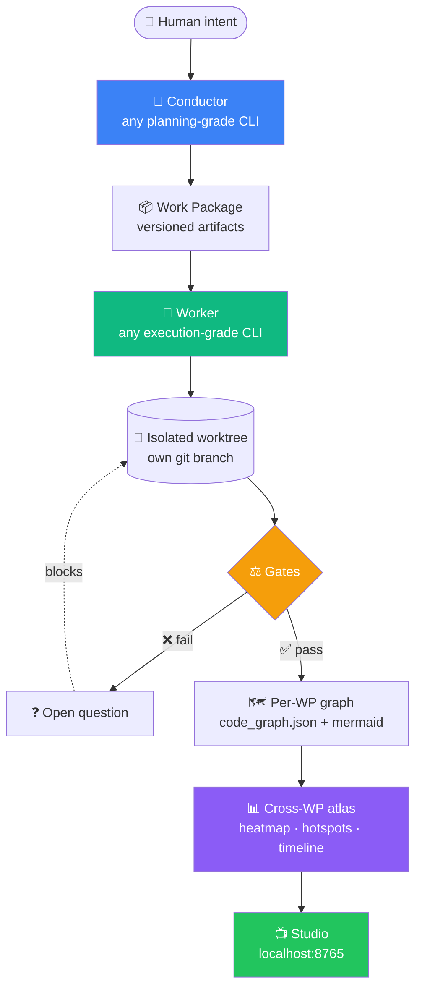
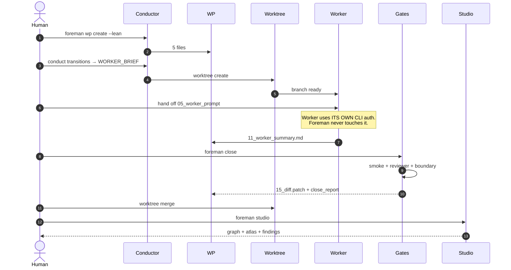

# 🏗️ Foreman

> **Site supervisor for AI coding crews.**
> Run Claude Code, OpenCode, Kimi, Qwen, DeepSeek, GPT, Codex side-by-side without collisions, duplicates, or context loss. Filesystem is the source of truth. No API keys required.

    

> ⚠️ **Alpha software.** Pre-1.0. Expect breaking changes between commits.
> Originally named **TCAD-H**; renamed to **Foreman** in v0.2 (the `tcad` command remains as a deprecated alias until v0.3).

```bash
git clone https://github.com/MiguelAAR10/foreman.git ~/.foreman
cd ~/.foreman && ./install.sh
foreman wp express --name "first-feature" --goal "Add /health endpoint" --role backend
```

---

## 🧭 Quick nav

[Why](#-why-this-exists) · [How it works](#-how-it-works) · [Auth model](#-auth-model-no-api-keys) · [Models](#-pick-any-model-per-role) · [Install](#-install) · [Express WP](#-30-second-express-wp) · [Manual WP](#%EF%B8%8F-manual-wp-when-express-is-too-fast) · [Iron rules](#%EF%B8%8F-iron-rules-and-what-they-actually-guarantee) · [Honest scope](#-honest-scope--what-foreman-does-not-do) · [Trial](#-the-field-trial)

**Deeper docs:** [Protocol](./docs/PROTOCOL.md) · [Quickstart](./docs/QUICKSTART.md) · [Concepts](./docs/CONCEPTS.md) · [CLI](./docs/CLI.md) · [Release](./docs/RELEASE.md) · [Trials](./docs/trials/README.md)

---

## 💡 Why this exists

Working with one coding agent is hard. Working with several in parallel breaks down on its own:

| Pain | Concrete failure |
|---|---|
| 🧠 **Context rot** | Agents hand each other 60K-token chat histories. Signal collapses. Prompt cache misses every turn. |
| 🎯 **Scope creep** | Agents proactively "fix" things outside the task. |
| 🪞 **Silent duplication** | Agent adds `def health()` even when one already exists six lines above. *(Real case caught in our Phase 2.3 trial.)* |
| 💥 **Race conditions** | Two terminals editing the same tree → ghost diffs, broken merges. |
| 🌊 **Diff overwhelm** | 500-line patch tells you nothing about which capability of the product changed. |

Foreman fixes each one with a **deterministic mechanism**, not a prompt.

> 🚫 **No model receives conversation history** (enforced via worker prompt + boundary firewall).
> ✅ **Every model receives versioned files on disk.**
> 🔑 **No API keys required**: workers run via their own CLI subscriptions.

---

## 🔭 How it works



**Every box is Python + git + JSON.** Zero LLM in the core pipeline. The LLM lives in the workers — never in the gates.

### What each gate actually catches

```mermaid
flowchart LR
    P[patch] --> B[🚧 Boundary firewall<br/>path-level<br/>git diff --name-only]
    B --> SM[🧪 Smoke gate<br/>shell commands you define]
    SM --> R[🛡️ Reviewer gate<br/>dup routes / symbols<br/>FastAPI · Express · Python]
    R --> M[🔀 Merge preconditions<br/>summary + blockers + ff-only]
    M --> ✓
    style B fill:#ef4444,color:#fff
    style SM fill:#f59e0b,color:#fff
    style R fill:#3b82f6,color:#fff
    style M fill:#10b981,color:#fff
```

---

## 🔑 Auth model: no API keys

**Foreman does NOT manage API tokens.** This is intentional.

| Layer | Who authenticates | How |
|---|---|---|
| **Foreman itself** | nobody | Just Python + git. Reads/writes local files. |
| **Conductor CLI** (Claude Code, Codex CLI, GPT-CLI…) | You, via the CLI's own subscription/login | `claude login`, `codex login`, etc. |
| **Worker CLI** (OpenCode, Kimi, Qwen, DeepSeek…) | You, via each CLI's own auth | `opencode auth`, `kimi login`, etc. |
| **Studio / Atlas / Doctor** | nobody | localhost only, no network. |

Foreman's job is **filesystem orchestration**, not API brokerage. When the worker needs to run, you launch its CLI in a separate terminal pointing at the WP folder. The CLI handles its own subscription billing.

**Why this matters:**
- No `.env` for API keys. No leaked secrets.
- Works with subscription tiers (you already pay $20/mo to Claude, not per-token).
- Switching providers is a CLI swap, not a code change.
- LATAM-friendly: you can mix Anthropic + Chinese self-hosted models without sending code to a single US provider.

---

## 🎚️ Pick any model per role

**Conductor is whatever CLI subscription you have.** Foreman does NOT lock you into Claude. Swap based on plan availability + task complexity.

| Role | Premium choice | Cheap choice | What this role does |
|---|---|---|---|
| 🎼 **Conductor** | Claude Code (Sonnet/Opus) | Codex CLI · Kimi CLI | Drives FSM. Plans. Generates Work Packages. Never writes code. |
| 👷 **Backend worker** | OpenCode + GPT-5 | OpenCode + Kimi K2 / Qwen-Coder | Reads WP, edits backend, writes summary. |
| 🎨 **Frontend worker** | Cursor / Claude Code | OpenCode + Qwen-Coder / DeepSeek | UI components, layouts. |
| 🧪 **Tests / Docs worker** | OpenCode + Claude Haiku | OpenCode + Minimax / DeepSeek | Cheap repetitive work. |
| 🛡️ **Reviewer** | Any CLI *different from worker* | local llama via OpenCode | Reads diff + report. Verdict PASS/FAIL. |
| 👀 **Watcher** | none — `foreman scan loop` | — | Pure Python. Zero LLM. Zero auth. |

> ⚖️ **Subscription budget rule.** If your Claude plan is throttling, drop the worker role to OpenCode + Kimi. The protocol stays the same. Only the CLI in the worker terminal changes.

Swap mid-project via `.protocol/terminals.yaml`:

```yaml
terminals:
  - id: T1
    role: conductor
    tool: claude-code            # or codex-cli, opencode, kimi-cli...
    model_family: claude
    auth: subscription           # CLI's own login. Foreman doesn't touch it.
  - id: T2
    role: backend-worker
    tool: opencode
    model_family: kimi
    fallback_models: [gpt, claude-haiku, qwen-coder]
    auth: subscription
```

FSM, gates, graph, atlas — **all model-agnostic + auth-agnostic by design.**

---

## ⚙️ Install

```bash
git clone https://github.com/MiguelAAR10/foreman.git ~/.foreman
cd ~/.foreman
./install.sh

# Ensure PATH (one-time, add to shell rc)
export PATH="$HOME/.local/bin:$PATH"

# Verify
foreman --version       # 0.1.0-alpha
foreman doctor          # health check
```

No sudo. No `pip install`. No PyPI dependency. The installer symlinks both
`foreman` (primary) and `tcad` (deprecated alias) into `~/.local/bin`. Override
with `FOREMAN_INSTALL_DIR` (or legacy `TCAD_INSTALL_DIR`).

---

## ⚡ 30-second express WP

For low-risk Work Packages (single file, well-defined change), use express mode:

```bash
cd /path/to/your/project

foreman wp express \
    --name "add-health" \
    --goal "Add /health endpoint" \
    --role backend
```

What happens automatically:

1. ✅ `.protocol/` bootstrapped if missing
2. ✅ Conductor state initialized if missing
3. ✅ Project profile detected if missing
4. ✅ Lean WP created (5 files)
5. ✅ Editor opens for `02_allowed_files.md` + `03_forbidden_files.md`
6. ✅ Conductor advances to `WORKER_BRIEF`
7. ✅ Isolated git worktree created

Then a one-line hand-off:

```
======================================================================
  WP-001-add-health is READY for the worker.
======================================================================
  Open a new terminal in:
      cd .protocol/worktrees/WP-001-add-health-backend
  Launch your worker CLI (auth via its OWN login — Foreman does NOT
  manage API keys):
      opencode    # or claude-code, kimi-cli, codex-cli...
  Read the worker prompt:
      .protocol/handoffs/WP-001-add-health/05_worker_prompt_backend.md

  When the worker finishes (writes 11_worker_summary.md):
      foreman close WP-001-add-health-backend --smoke-test "pytest -q"
      foreman graph build WP-001-add-health
      foreman worktree merge WP-001-add-health-backend
      foreman worktree destroy WP-001-add-health-backend
      foreman atlas build
======================================================================
```

Skip the editor with `--allowed "src/**" --forbidden ".env*"`.

---

## 🛠️ Manual WP (when express is too fast)



Run `foreman quickstart` to see the manual command list anytime.
Full walkthrough: [`docs/QUICKSTART.md`](./docs/QUICKSTART.md).

---

## ⚔️ Iron rules and what they actually guarantee

Five rules. Some are enforced structurally. Some are **policies** that the boundary firewall + reviewer gate make hard to violate but not impossible. Honest framing:

| # | Rule | Enforcement strength |
|---:|---|---|
| 1 | 🚫 No model receives conversation history. | **Policy.** Worker prompt restricts reads to WP files. Boundary firewall catches writes outside scope. A misbehaving CLI that *reads* extra files for context isn't blocked — best effort, not invariant. |
| 2 | 🛑 The Conductor never writes production code. | **Structural.** Conductor terminal scope = `.protocol/` + `specs/` only. Boundary firewall enforces. |
| 3 | 🔁 The Reviewer is never the Implementer. | **Policy.** Encoded in `review_pairing` rules in `terminals.yaml`. Human discipline still required. |
| 4 | 🚧 Open blocking questions halt progress. | **Structural.** FSM guards reject transitions while questions are pending. |
| 5 | 📏 No edit outside the WP's `02_allowed_files.md`. | **Structural.** `foreman boundaries check` exits non-zero on hard violation. `--rollback` reverts. |

Full spec: [`docs/PROTOCOL.md`](./docs/PROTOCOL.md).

---

## 🪞 Honest scope — what Foreman does NOT do

The Staff-Engineer review of v0.1.0-alpha was sharp and right. Honest limitations:

| Promise people might assume | Reality of v0.1.0 |
|---|---|
| "Detects duplicate code" | Only **same-file** duplicate routes (FastAPI/Express) and Python top-level functions/classes. Cross-file duplicates (the common case) are deferred. |
| "Works with any framework" | Route detection: FastAPI + Express only. Flask/Django/NestJS/Hono = no detector yet. Frontend component dedup = no detector yet. |
| "1-click install" | `git clone` + `install.sh` + manual `PATH` edit. No PyPI, no Homebrew, no `pipx` yet. |
| "Auto-orchestration" | Foreman does NOT call the worker CLI for you. You launch it manually in a separate terminal. Foreman supervises the filesystem, not the network. |
| "Saves you tokens" | Real benefit is **throughput** (multiple workers in parallel) + auditability. Token savings exist (Conductor cheap CLI + workers cheap CLI) but the dollar number is secondary — measured ~60% on small WPs, less on big ones. |
| "Replaces Claude Code" | No. Foreman *coordinates* Claude Code with other CLIs. Use Claude Code as your Conductor. |
| "Production-ready" | Alpha. No automated tests for the Python core. Field trial in progress. |

The full deferred list lives in [`docs/RELEASE.md`](./docs/RELEASE.md). What's already working is in the [capability matrix below](#-what-works-today-alpha-ready).

---

## ✅ What works today (alpha-ready)

<details>
<summary><strong>Capability matrix</strong></summary>

| Capability | Notes |
|---|---|
| Lean / verbose Work Packages | 5 vs 12 files |
| Express WP (init+create+FSM+worktree in 1 cmd) | Staff-Engineer feedback fix |
| Git worktree isolation per WP+role | full lifecycle |
| Conductor FSM (17 states, deterministic) | Python only |
| Path boundary firewall (OS-level) | `foreman boundaries check --rollback` |
| Smoke-test gate (YAML config) | per-group |
| Deterministic reviewer gate | **same-file** FastAPI/Express dup routes + Python symbols |
| Evidence capture | patch + journal + close report |
| Per-WP static graph | code_graph.json + mermaid |
| Cross-WP atlas | heatmap, hotspots, timeline |
| Project profile detection | FastAPI / Next / React / Django / monorepo |
| Studio localhost UI | stdlib HTTP, no build step |
| `foreman doctor` | 20+ checks + suggestions |
| `foreman report alpha` | digest + next-action |
| CLI subscription auth model | no API keys, ever |

</details>

---

## 🛤️ Where we are

```mermaid
flowchart LR
    P1[1<br/>Handoff MVP] --> P15[1.5<br/>FSM]
    P15 --> P17[1.7<br/>Studio v0]
    P17 --> P18[1.8<br/>Boundaries]
    P18 --> P19[1.9<br/>Worktrees]
    P19 --> P2[2<br/>Evidence]
    P2 --> P21[2.1<br/>Dogfood]
    P21 --> P22[2.2<br/>Fixes]
    P22 --> P23[2.3<br/>🔥 Real trial]
    P23 --> P24[2.4<br/>Reviewer]
    P24 --> P25[2.5a<br/>Graph]
    P25 --> P3[3<br/>Studio API]
    P3 --> P31[3.1<br/>Profile]
    P31 --> P33[3.3<br/>Atlas]
    P33 --> P34[3.4<br/>📦 Alpha pkg]
    P34 --> P35{3.5<br/>Field trial}

    style P23 fill:#ef4444,color:#fff
    style P34 fill:#22c55e,color:#fff
    style P35 fill:#facc15,color:#000
```



**🔥 Phase 2.3** = real external trial that caught a duplicate-route bug Foreman now blocks deterministically.
**📦 Phase 3.4** = alpha packaging — `install.sh`, `foreman` CLI, `foreman doctor`, docs.
**🟡 Phase 3.5** = field trial in progress. No new features ship until [`docs/trials/DECISION_REPORT.md`](./docs/trials/DECISION_REPORT.md) lands.

Full per-phase ledger: [`CHANGELOG.md`](./CHANGELOG.md).

---

## 🧪 The field trial

> *"Foreman has the engine and the key. Now it needs a week on real roads."*

Until [`docs/trials/DECISION_REPORT.md`](./docs/trials/DECISION_REPORT.md) is written, the answer to *"should we build X?"* is **"use it first."**

The trial measures (hard numbers, not narrative):

1. **Human time per WP closed** — and the same WP done with just Claude Code alone, as baseline.
2. **Re-work rate** — FIX_REQUEST cycles per WP.
3. **Gate catches** — WPs where the reviewer or smoke gate caught something the human would have merged.
4. **Subscription throughput** — WPs/hour with parallel workers vs serial.
5. **Friction** — places the human had to leave the protocol.

Scaffolding: [`docs/trials/`](./docs/trials/README.md).

---

## 📂 Project layout

```
🏗️  foreman/
├── 📄  README.md · LICENSE · CHANGELOG.md · VERSION.md
├── 🤝  AGENTS.md · CLAUDE.md · OPENCODE.md    autodiscovery for agent CLIs
├── 📦  install.sh                              local installer (foreman + tcad alias)
├── 🐍  bin/foreman · bin/tcad                  CLI dispatcher (+ deprecated alias)
├── 🛠️  scripts/                                ~16 Python tools (stdlib only)
│   ├── _tcad_root.py · _tcad_lock.py · _tcad_yaml.py    shared helpers
│   ├── tcad_handoff · tcad_conduct · tcad_worktree · tcad_log
│   ├── tcad_scan · tcad_check_boundaries · tcad_review · tcad_graph
│   ├── tcad_profile · tcad_atlas · tcad_init · tcad_doctor
│   ├── tcad_report                             alpha state digest
│   └── tcad_express                            ⚡ low-friction WP launcher
├── 📺  studio/                                 localhost dashboard
├── 📚  docs/
│   ├── PROTOCOL · RELEASE · QUICKSTART · CONCEPTS · CLI
│   └── 🧪 trials/                              formal trial reports
├── ⚙️  .protocol/                              runtime state (handoffs, journal, atlas)
└── 📦  legacy/                                 v1 markdown (pre-protocol)
```

Internal script filenames keep the `tcad_` prefix for v0.1 — v0.2 may rename them. The user-facing CLI is already `foreman`.

---

## 🤝 Contributing

While Foreman is in alpha, contributions are limited to:

1. **Frictions** — append to [`docs/trials/FRICTION_REGISTER.md`](./docs/trials/FRICTION_REGISTER.md) after using Foreman on a real WP.
2. **Reviewer-detector ideas** — propose a new deterministic check (Flask route detector, NestJS controller dupe, cross-file Python imports) with the failure case you saw.
3. **Smoke-group recipes** — share `smoke_tests.yaml` patterns for your stack.

No code PRs accepted until the field trial closes and [`docs/trials/DECISION_REPORT.md`](./docs/trials/DECISION_REPORT.md) declares *Keep*.

---

## 📊 Status

| Metric | Value |
|---|---|
| Phase | 3.5 field trial (in progress) |
| LOC (Python core) | ~6,400 |
| Iron rules holding | 5 / 5 (with honest enforcement notes) |
| LLM calls in core pipeline | 0 |
| External trial findings | 11 caught · 1 critical fixed |
| Worker CLIs supported | any (Claude Code, OpenCode, Kimi, Qwen, DeepSeek, Codex, GPT) |
| API keys required | 0 |

## 📜 License

[MIT](./LICENSE) — committed as declaration of intent for v1.0. Until v1.0, the project is published for evaluation. The license is real and applicable; the alpha designation refers to feature stability, not legal status.

## 👤 Contact

Maintainer: [Miguel](https://github.com/MiguelAAR10) · [@MiguelAAR10](https://github.com/MiguelAAR10)
